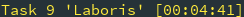

# Active #

The active report displays the current active tasks, and the duration of time
that has been spent in that interval. The same global report options apply
aswell.

The output of the active report follows this format:

```
Task ## 'Project' [HH:MM:SS]
```

## Sample Active Report ##


