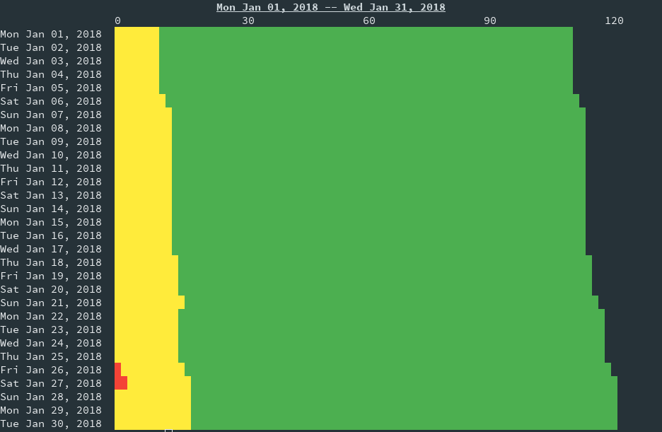

# Burndown #

The burdown report displays a burndown graph of the tasks compleation rate of
tasks. It displays all the tasks according to a color code. Showing the pending
tasks in one color, started tasks in another, and completed tasks in a final
color. The same global report options apply as well.

The output of the burndown report follows this format:

```
Date Range
     0...total number of tasks
Date pending started completed
```
## Arguments ##

There are two arguments in the burndown report `start`, and `stop`.

The `start` arguments must be a [valid date time](../options/datetime.md). When
specified only dates that occurred after that date time will be
displayed. This defaults to one week ago.

The `stop` argument must also be a [valid date time](../options/datetime.md).
When specified only dates before that occurs before that date time
will be displayed. This defaults to the current day.

## Options ##

There is only one option and that is `--trim`. 

`--trim` will remove the dates before and after where there is no data recored.
These removed dates will not be displayed.

## Sample Burndown Report ##


