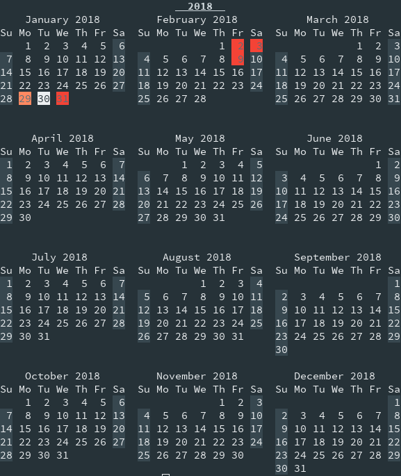

# Calendar #

The calendar report displays a monthly calendar with the due-dates and the
current day highlighted. It can also display multiple months in advance to plan
for future due dates. The same global report options apply as well.

The output of the calendar report follows this format where weekends are greyed
out, due dates are highlighted in the corresponding color, and the current date
is also highlighted:

```
      Year
      Month
Su Mo Tu We Th Fr Sa
00 01 ...
.  .
```

## Arguments ##

There are two arguments `start`, and `stop`.

The `start` argument must be a [valid month](../options/month.md). When
specified that month will be displayed instead of the current month.

The `stop` argument must be a [valid month](../options/month.md). When
specified every month between `start` and `stop` (inclusivly) are displayed.

## Sample Calendar Report ##


