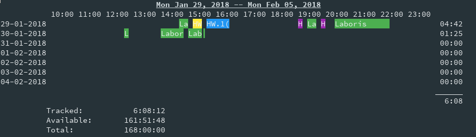

# Graph #

The graph report displays a timeline graph of the intervals spent on any given
task, or project. The graph report collects all the time intervals spent on
tasks, and displays them if they are within the provided time range. In
settings is is posible to set the start and end times for the graph timeline,
cutting off any tasks that occure before or after these times. The same global
report options apply as well.

The output of the graph report follows this format:

```
Date Range
     HH:MM HH:MM ...
Date Tasks ...       Total duration for the day
.    .               .
.    .               .
.    .               .
                     Overall total duration

     Tracked: Total duration
     Avaliable: Total untracked time
     Total: Total time
```

## Arguments ##

There are two arguments in the times report `start`, and `stop`.

The `start` arguments must be a [valid date time](../options/datetime.md). When
specified only dates that occurred after that date time will be
displayed. This defaults to one week ago.

The `stop` argument must also be a [valid date time](../options/datetime.md).
When specified only dates before that occurs before that date time
will be displayed. This defaults to the current day.

## Options ##

There are two options `--trim`, and `--trim-all`.

`--trim` will remove the dates before and after where there is no data recored.
These removed dates will not be displayed.

`--trim-all` will remove any dates that do not have any time interval recored.
These removed dates will not be displayed.

## Sample Graph Report ##



