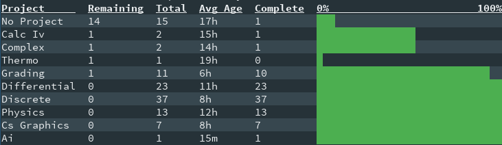

# Summary #

The summary report displays the progress of each project. Counting the number
of total tasks and completed tasks for each project. By default it only shows
the projects with active tasks. The same global report options apply as well.

The output of the summary report follows this format:

```
Project Name, Remaining Tasks, Total Tasks, Average Age of Tasks, Completed
Tasks, Bar graph showing completion
```

## Options ##

There is only one option `--all`.

`--all` will make the report display projects where all the tasks have been
completed.

## Sample Summary Report ##



