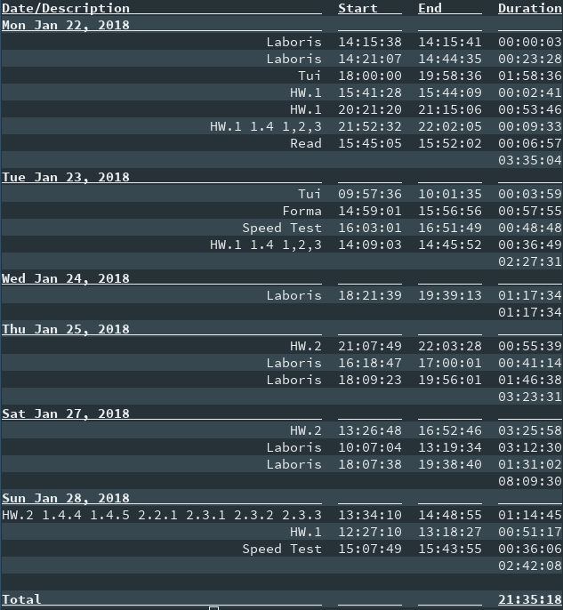

# Times #

The times report displays the time intervals spent on any given task, or
project. The times report collects all the time intervals spent on tasks, and
displays them if they are within the provided time range. The same global
report options apply as well.

The output of the times report follows this format:

```
Date/Description Start End Durration
.
.
.
Total: Total Durration
```


## Arguments ##

There are two arguments in the times report `start`, and `stop`.

The `start` arguments must be a [valid date time](../options/datetime.md). When
specified only time intervals that occurred after that date time will be
displayed. This defaults to the beginning of the current day.

The `stop` argument must also be a [valid date time](../options/datetime.md).
When specified only time intervals before that occurs before that date time
will be displayed. This defaults to the end of the current day.

## Options ##

There is only one option and that is `--group`.

This option species the group of tasks that are allowed to be seen. The options
for `--group` are `all`, `pending`, and `completed`. If `all` is selected, then
intervals from tasks that are either pending or done are displayed, if
`pending` is selected, then only intervals from tasks that are pending are
displayed, and if `done` is selected, then only intervals from completed tasks
are displayed.

## Sample Times Report ##


